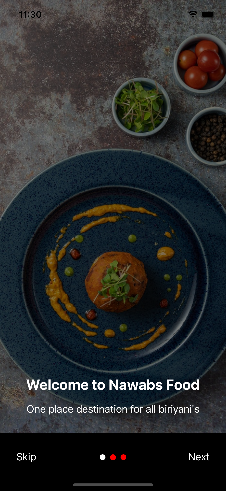
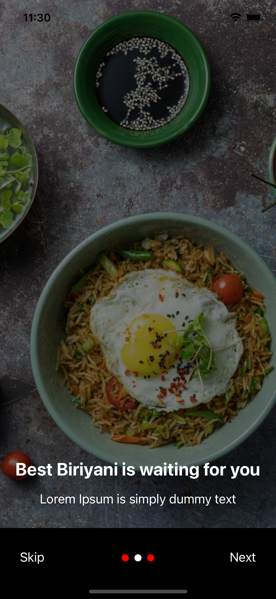
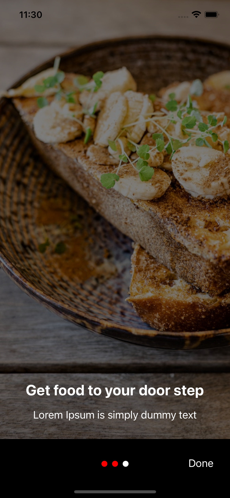
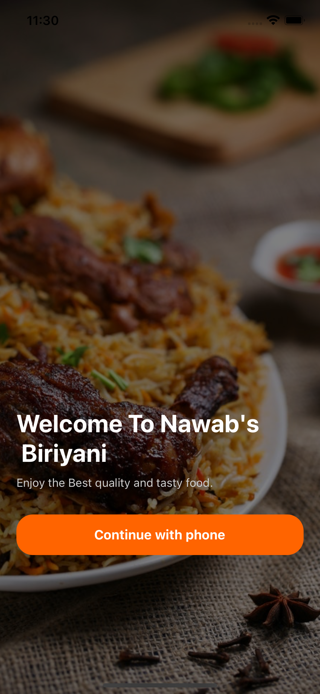
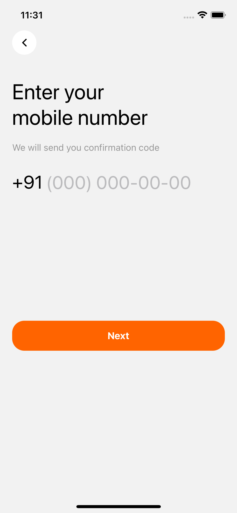
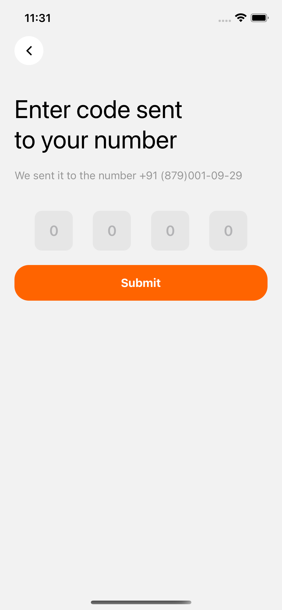
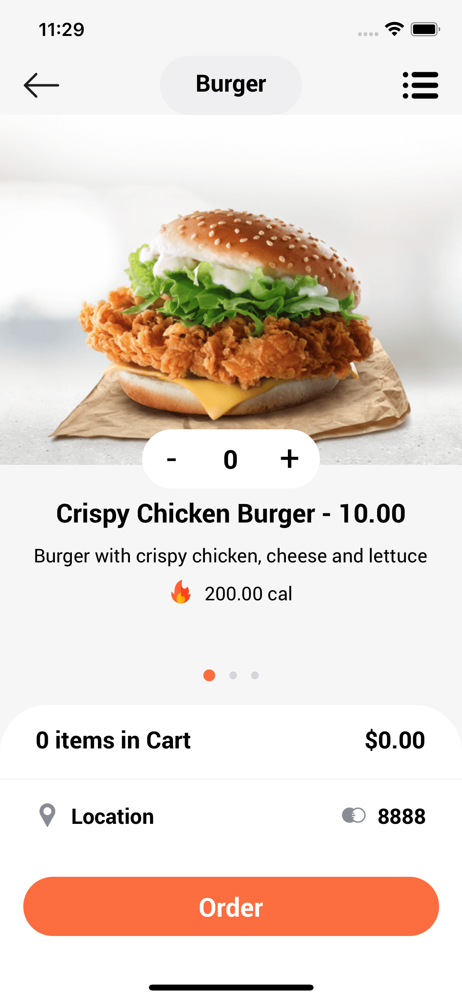

<h1 align="center">Hello All, This is a sample Restarent app design application 👋</h1>

> To run this application you need to the following steps.  

## FOR Android:
clean the existing build with cmd `cd android && ./gradlew clean`.
Then install all the packages with cmd `npm install`
fillnally run `react-native run-android`

## FOR IOS:

clean the existing build with cmd `cd ios && xcodebuild clean`
Then install all the packages with cmd `npm install`
now do `pod install` in the same ios folder
fillnally run `react-native run-ios`

## ✨ Demo Gif of all screens

This is a demo project developed with few screens from dribble.com

  

## Replacement for vector icons
In this demo app i used `Flaticons website` for all the icons we can the color of icons with style `tinitColor: <color name>`

## All Screen Screeshots

  
  
  
  
  
  
  
  

